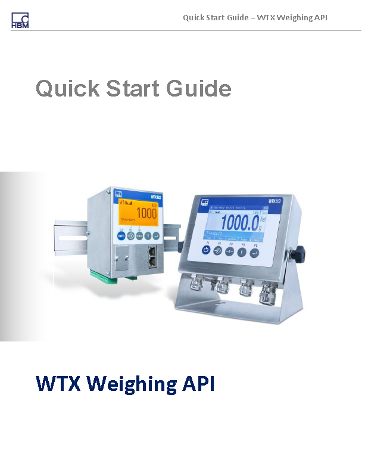

# HBM Weighing API

Connect your own application to weighing terminals WTX110-A and WTX120 from HBM.

Contains API and 3 templates (Console application, Simple GUI, PLC view). 

## License

Copyright (c) 2019 HBM. See the [LICENSE](LICENSE) file for license rights and
limitations (MIT).
